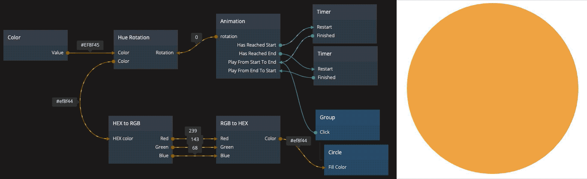

# noodl-color-utility-module

A module that do common color translations and manipulations.

## Install
Modules are placed in a folder called `noodl_modules` *inside* the `project folder`. After modules have been added or changed refresh the Noodl project to have the changes take place/the nodes being accessible.

## Docs

---
#### Hex To Rgb
Takes a hex value (#000000) and outputs the red, green and blue as separate values (0-255)

##### Inputs
- __HEX color__: `color` The HEX color (from a Color node or as a string) that will be converted into RGB.

##### Outputs
- __Red__: `number` The red color value (`0`-`255`).
- __Green__: `number` The green color value (`0`-`255`).
- __Blue__: `number` The blue color value (`0`-`255`).

---
#### Rgb To Hex
Takes three different values (red, green and blue) and outputs the HEX color.

##### Inputs
- __Red__: `number` The red color value (`0`-`255`).
- __Green__: `number` The green color value (`0`-`255`).
- __Blue__: `number` The blue color value (`0`-`255`).

##### Outputs
- __Color__: `color` The HEX color (as a string).

---
#### Hue Rotation
Takes a HEX color value, converts it into HSL (hue, saturation, light) and rotate the hue with the number of degrees specified.

##### Inputs
- __Color__: `color` A HEX color value (from a Color node or as a string) that will be rotated.
- __Rotation__: `number` The number of degrees that the hue should be rotated.

##### Outputs
- __Color__: `color` The rotated color converted back into a HEX color (as a string).
